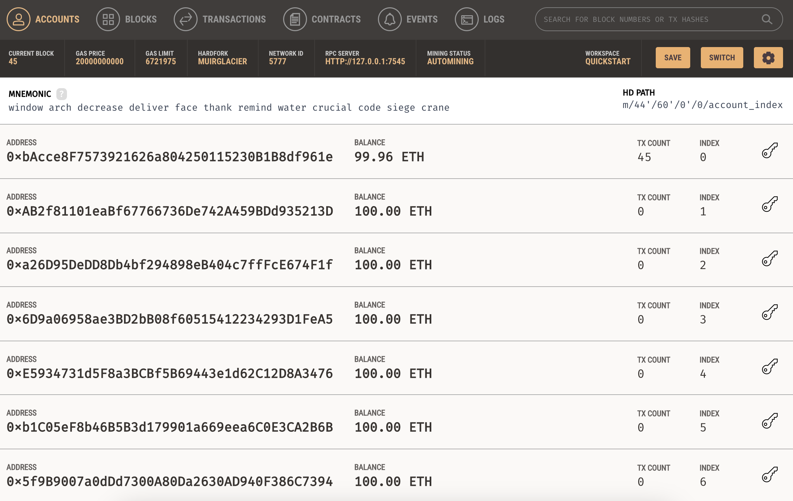

# Smart Contract

The Giveaways smart contract is a Solidity contract that allows for the creation of giveaways in the Ethereum blockchain, where a winner or winners can be randomly selected from a list of eligible participants. It provides functionality to create a giveaway, add participants and generate winners, as well as some getter function to facilitate testing.

## Setup

### Install Ganache

Ganache is a local development blockchain used to develop decentralized applications (DApps) on the Ethereum blockchain. It simulates the Ethereum network, and lets you check how the app will perform before releasing it to production.

Once you install it, open it and click on _Quickstart Ethereum_. It should look something like this:



As you can see, it provides you with some test accounts that already have Ether in them so you can deploy and test the smart contract. If you ever run out of Ether just restart Ganache.

Before continuing you can copy the address of the first account and add it to your `.env` file under `OWNER_ACCOUNT_ADDRESS`. This is the address that will be used to deploy the contract to your local blockchain and, therefore, the owner of the contract.

### Install Truffle and deploy contract

#### If this is your first time

Truffle is a development environment, testing framework and asset pipeline for Ethereum, aiming to make life as an Ethereum developer easier. To install it in your development environment and deploy the current contract for the first time just run the following command:

```
yarn setup-contract
```

This command will enter the `truffle-app` folder, install truffle globally, compile the contract and deploy. Once the deploy is done, save the contract address provided in the console and add it to you `.env` file under `GIVEAWAYS_CONTRACT_ADDRESS`.

#### If you already ran `setup-contract` once and just want to redeploy

If you already ran `setup-contract` once and just want to redeploy the contract after resetting Ganache, you can just run the command `yarn redeploy-contract`. This command will enter the `truffle-app` folder, compile the contract and deploy it. Don't forget to update the contract address in your `.env` file.

#### If you ran `setup-contract` once and want to modify the contract

From there, you can run `truffle compile`, `truffle migrate` (`truffle migrate --reset` if you already ran `truffle migrate` once) and `truffle test` to compile your contract, deploy the contract to the network, and run the associated unit tests.

## Deployment

To deploy the smart contract to a public blockchain you are going to need to create an `.env` file and add the following variables:

- `INFURA_API_KEY`: API key from your created Infura Account. [Infura](https://www.infura.io/) will be used to access public networks using an API.
- `PRIVATE_KEY`: Private key of the account you want to use to deploy your smart contract (make sure you have sufficient funds for the deployment).

Then, similar to the development deployments, just run the migrate command and specify the network you want to use. For example:

```
truffle migrate --network sepolia
```
